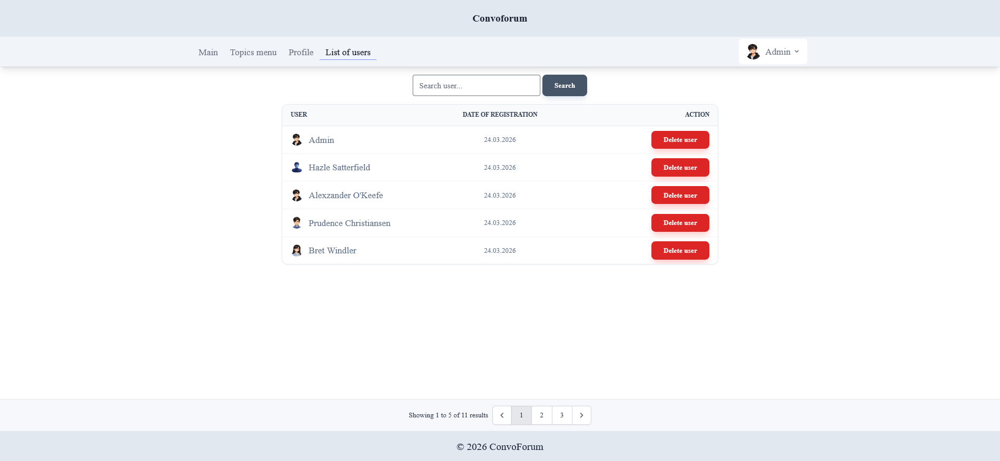

ConvoForum

**ConvoForum** is a web forum application where users can create topics, publish posts, and interact through discussions.

The project is built with Laravel and focuses on clean architecture, user roles, and real-world backend functionality.

---

Features

* Authentication (registration & login)
* Email verification
* User roles (admin / user)
* CRUD for posts
* CRUD for topics
* Image upload (posts & avatars)
* Search (posts, topics, users)
* Admin panel (user management)
* Pagination
* Responsive design

---

Tech Stack

* **Laravel 12**
* **PHP 8.4**
* **MySQL**
* **Blade**
* **Tailwind CSS**
* **Laravel Breeze**
* **Native JavaScript:
  * image preview before upload
  * dynamic form behavior (topic selection)

---

Key Features

* First registered user automatically becomes **admin**
* Soft deletes for data safety
* Protection against deleting admin users
* Custom delete logic:
  * removes avatar files
  * handles related posts
* Responsive UI (mobile-friendly)
* Use of model methods (`isAdmin()`) for role checks
* Database seeding with factories
* Dynamic footer stats (users & posts count)

---

Installation

```bash
git clone https://github.com/AntonSot-Github/ConvoForum.git

cd convoforum

composer install
npm install

cp .env.example .env
php artisan key:generate

php artisan migrate --seed

php artisan storage:link

npm run dev
php artisan serve

```

---

## Demo Admin Account

Email: admin@test.com  
Password: password

---

## Screenshots

### Main page with posts


### Edit profile page


### List of topics 


### List of users


### Post create page


### Post image view


---

Future Improvements

* Advanced search (full-text / external search engine)
* Notifications system
* Real-time updates (WebSockets)

---

Developed by **AntonShv**

---

License

This project is open-source and available under the MIT License.
